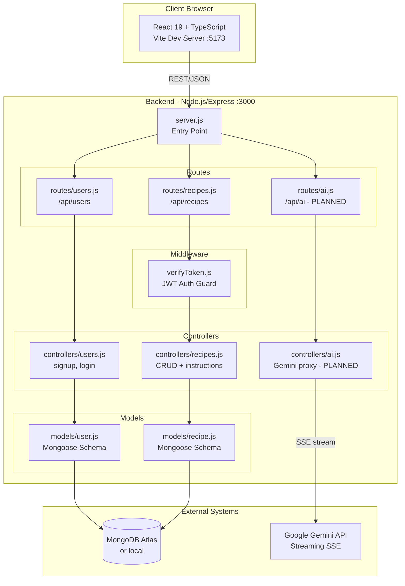

# System Architecture

## Overview
Spoonful is a full-stack recipe management web application using a MERN (MongoDB, Express, React, Node.js) architecture. The Express backend provides a REST API with JWT authentication, while the React/TypeScript frontend (currently a skeleton) consumes that API to let users browse, create, and manage recipes, plus an AI assistant powered by Google Gemini.

## Architecture Diagram

## Layer Summary

| Layer | Purpose | Key Components |
|-------|---------|----------------|
| Presentation | React SPA — UI, routing, state | App.tsx, pages (planned), axios calls |
| Application | Express route wiring + middleware | server.js, routes/*.js, verifyToken.js |
| Business Logic | Request handling, auth, ownership checks | controllers/users.js, controllers/recipes.js |
| Data | Mongoose ODM, schema definitions | models/user.js, models/recipe.js |
| Infrastructure | Docker containers, env config | Dockerfile (x2), docker-compose files |

## External Integrations

- **MongoDB**: primary data store, connected via `MONGO_URL` env var using Mongoose
- **Google Gemini API**: streaming text generation for AI Assistant feature (PLANNED); proxied through backend; key in `GEMINI_API_KEY` env var
- **JWT**: stateless auth tokens signed with `JWT_SECRET`, 24h expiry
