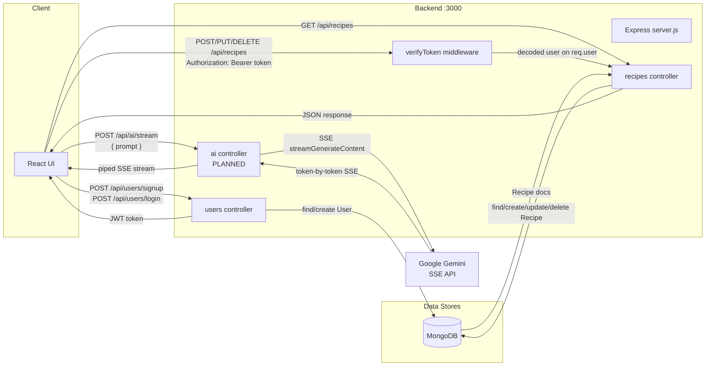

# Data Flow

## Overview
Three primary data flows: (1) auth — signup/login issuing JWT tokens; (2) recipe CRUD — authenticated write paths and public read paths; (3) AI streaming — client prompt forwarded to Gemini, SSE stream piped back.

## Data Flow Diagram

## Data Pipelines

| Pipeline | Source | Processing | Destination |
|----------|--------|-----------|-------------|
| Auth signup | Client POST /api/users/signup | bcrypt hash password, create User, sign JWT | Client receives `{ token }` |
| Auth login | Client POST /api/users/login | Lookup user by email, comparePassword, sign JWT | Client receives `{ token }` |
| Recipe read (public) | Client GET /api/recipes | Optional query filter (title/tag/ingredient), MongoDB find | JSON array of recipes |
| Recipe write | Client POST/PUT/DELETE with JWT | verifyToken → decode user → CRUD with ownership check | Updated recipe doc or confirmation |
| AI streaming | Client POST /api/ai/stream with prompt | Validate prompt, proxy to Gemini SSE endpoint | SSE stream piped directly to client |

## Integration Points

- **MongoDB** (`MONGO_URL` env): inbound — all persistent read/write for users and recipes
- **Google Gemini** (`GEMINI_API_KEY` env): outbound streaming — AI assistant feature; backend is proxy, key never reaches client
- **JWT** (`JWT_SECRET` env): inline — token issued at login/signup, verified on protected routes
