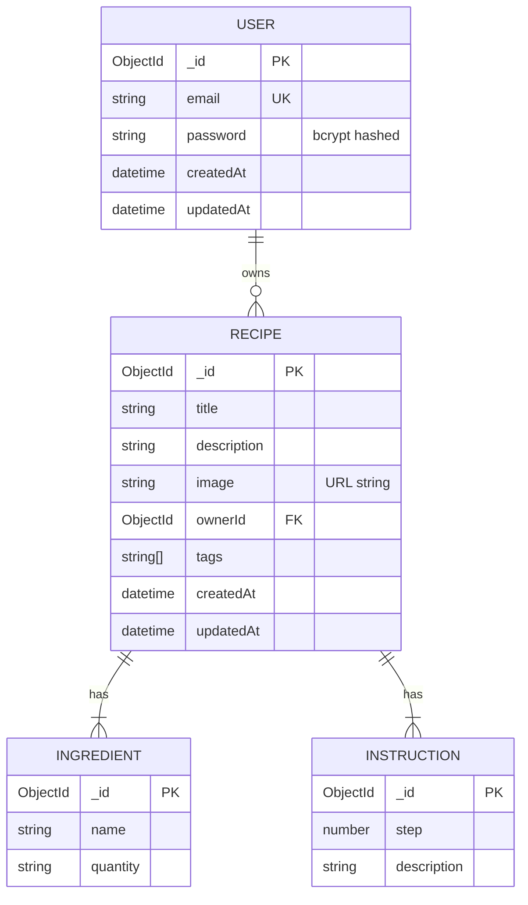

# Data Model

## Overview
The data layer uses MongoDB (via Mongoose). Two primary collections: `users` and `recipes`. Recipes embed sub-documents for ingredients and instructions, and reference their owner via `ownerId`.

## Entity Relationship Diagram

## Key Entities

| Entity | Purpose | Key Fields | Relationships |
|--------|---------|------------|---------------|
| User | Authenticated recipe creator | email (unique), password (hashed) | owns many Recipes |
| Recipe | Core content unit | title, image URL, ownerId, tags[] | owned by one User; embeds Ingredients and Instructions |
| Ingredient | Sub-document for a recipe component | name, quantity | embedded in Recipe |
| Instruction | Sub-document for a cooking step | step (number), description | embedded in Recipe |

## Data Stores

| Store | Type | Purpose |
|-------|------|---------|
| MongoDB | Document database | Primary persistent store for users and recipes |
