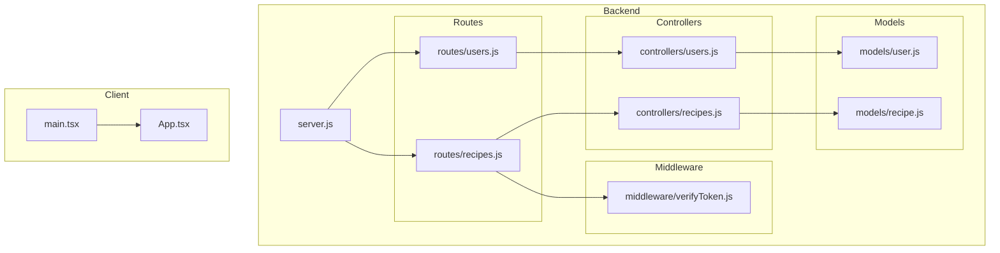

# Module Dependencies

## Overview
The backend follows a classic MVC layering: routes import controllers and middleware; controllers import models; models import mongoose. The client is currently a bare Vite+React skeleton with no internal modules beyond App.tsx.

## Dependency Graph

## Coupling Analysis

| Module | Fan-In | Fan-Out | Assessment |
|--------|--------|---------|------------|
| models/user.js | 1 (controllers/users) | 2 (mongoose, bcrypt) | Low risk — isolated data layer |
| models/recipe.js | 1 (controllers/recipes) | 1 (mongoose) | Low risk — isolated data layer |
| middleware/verifyToken.js | 1 (routes/recipes) | 1 (jsonwebtoken) | Low risk — single concern |
| controllers/users.js | 1 (routes/users) | 2 (models/user, jsonwebtoken) | Low risk |
| controllers/recipes.js | 1 (routes/recipes) | 1 (models/recipe) | High symbol count (20 symbols) — core business logic, change carefully |
| server.js | 0 | 4 (express, mongoose, morgan, cors) | Entry point — orchestrates everything |

## Circular Dependencies

None detected.
